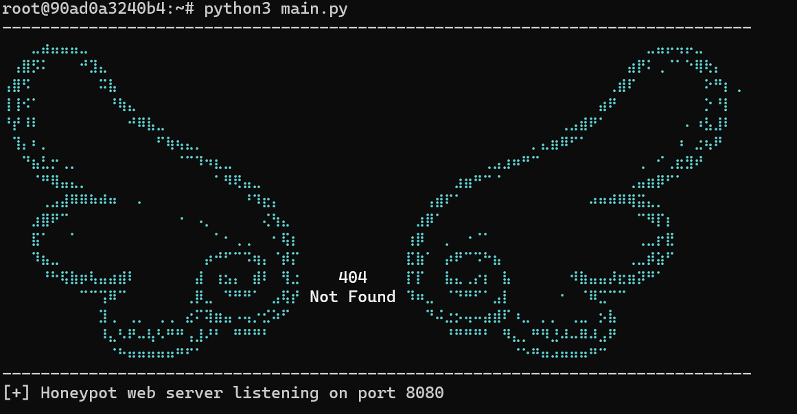
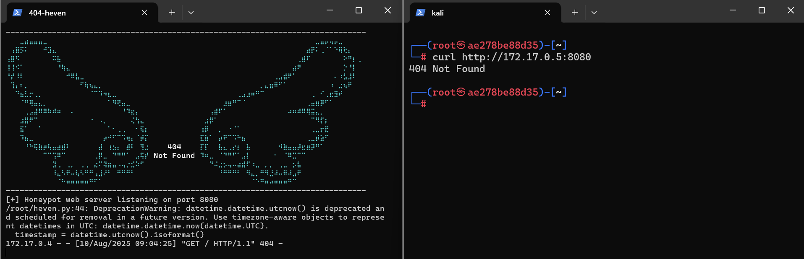
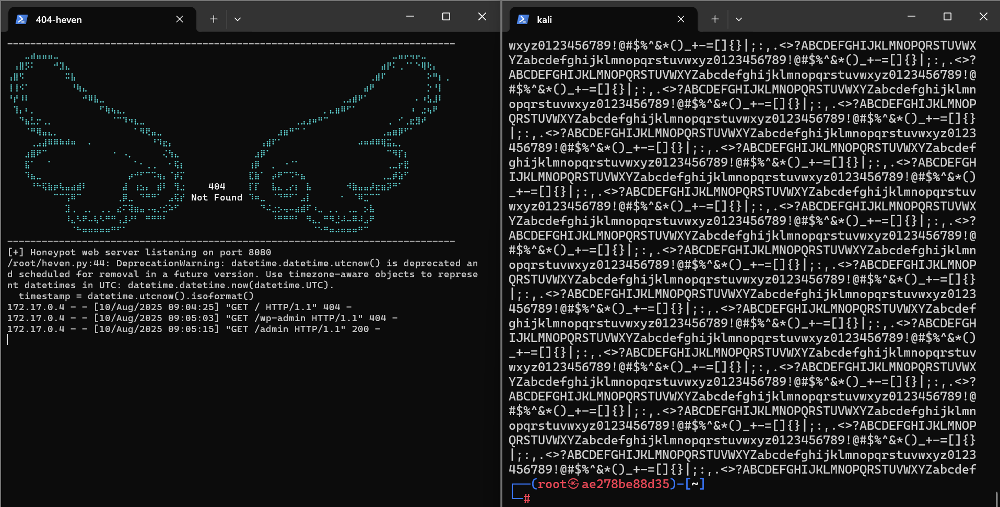
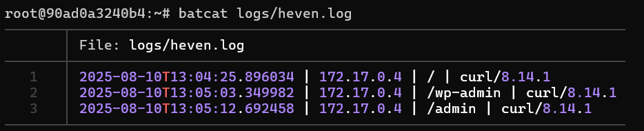

# 404 - heven

## Informacion
### 404 heven es un honeypot que despliega un servicio web usando python, escuchando en el puerto 8080 y esperando peticiones a ciertos directorios para devolver un output de 10 mb (aunque este puede modificarse) al atacante.
     #Se pueden modificar los megabites de el payload
     #volviendolo menos o mas robusto
     def generate_payload(size_in_mb=10):

### El honeypot esta creado para molestar a alogunos hackers curiosos o proporcionar un exceso de informacion falsa a algunos bots que realizan ataquers de fuzzing.

### El honeypot contiene una lista de las "rutas trampa" las cuales se recomienda modificar, agregando mas paths o rutas para propositos especificos.
     # Rutas señuelo
     bait_paths = [
     "/admin",
     "/wp-login",
     "/phpmyadmin",
     "/backup"
     ]

## Instalacion
### La instalacion se puede realizar tanto local como en docker.
-   ### Local:
     #instalacion de recursos
     apt update && apt install -y git python3
     #clonar repositorio y desplegar herramienta
     git clone https://github.com/0d1n-oss/404-heven.git && cd 404-heven/
     python3 main.py
-   ### Docker:
     #Instalar docker
     apt update && apt install -y git docker
     #Clonar repositorio
     git clone https://github.com/0d1n-oss/404_heven.git && cd 404-heven/
     #creacion de la imagen:
     docker build -t 404-heven:latest .

     #Inicio de el contenedor.
     docker run -d --name heven -v ./heven:/app/logs 404-heven:latest

## Pruebas
### Se creo un entorno con dos maquinas, la maquina heven (la herramienta) y la maquina kali (El atacante)

### Ya con las maquinas desplegadas, se hizo una peticion con curl al servidor (http://172.17.0.5:8080) la cual no regreso nada.

### Probando con otra ruta (/admin) se puede ver el payload que regresa.

### Creditos
Copyright © 2025 by [0d1n-oss](https://github.com/0d1n-oss)
